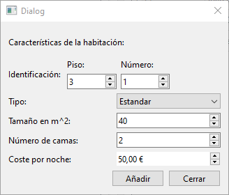

# Clase Habitación

Esta clase busca gestionar, utilizando Programación Orientada a Objetos, las propiedades y métodos necesarios para establecer la funcionalidad de gestionar una habitación en un servicio hotelero.

{style="display: block; margin: 0 auto"}

