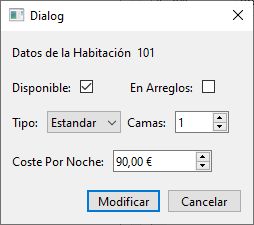

# Ventana Estado de Habitación

Esta ventana y su clase correspondiente, manejan la lógica para mostrar los datos de una habitación específica del hotel y permitir hacer modificaciones a dichos datos. Utiliza como base una ventana QDialog de Qt.

## Elementos

### Atributos

|||
|---|---|
|Ui::EstadoHabitacion*|[ui](#ui-uiestadohabitacion)|
|[Habitacion](../../Clases/Habitacion)*|[habitacion](#habitacion-habitacion)|
|[ControladorBD](../../Clases/ControladorBD)*|[controladorBD](#controladorbd-controladorbd)|

***

### Métodos Públicos

|Retorno|Método|
|---|---|
||[EstadoHabitacion](#estadohabitacioncontroladorbd-controladorbd-qwidget-parent--nullptr)([ControladorBD](../../Clases/ControladorBD)* controladorBD, QWidget* parent = nullptr)|
||~[EstadoHabitacion](#estadohabitacion)()|
|void|[setHabitacion](#habitacion-habitacion)([Habitacion](../../Clases/Habitacion)* habitacion)|
|void|[mostrar](#void-mostrar)()|
|void|[limpiar](#void-limpiar)()|

### Slots Públicos

|Retorno|Slot|
|---|---|
|void|[cerrar](#void-cerrar)()|
|void|[modificar](#void-modificar)()|

### Señales

|Retorno|Señal|
|---|---|
|void|[actualizar](#void-actualizarbool-actualizar--false)(bool actualizar = false)|

## Descripción Detallada

### ui: Ui::EstadoHabitacion*

Este atributo almacena una referencia a la interfaz del usuario para poder acceder a los elementos visuales incuidos en ella.

***

### habitacion: [Habitacion](../../Clases/Habitacion)*

Este atributo almacena una referencia al objeto de tipo [Habitacion](../../Clases/Habitacion) cuyos datos serán mostrados y/o modificados.  
Este valor se inicializa como `nullptr` al crear una instancia.  
  
**Funciones de acceso:**
  
|Tipo|Retorno|Función|
|---|---|---|
|Escritura|void|setHabitacion([Habitacion](../../Clases/Habitacion)* habitacion)|

***

### controladorBD: [ControladorBD](../../Clases/ControladorBD)*

Este atributo almacena una referencia al objeto de tipo [ControladorBD](../../Clases/ControladorBD) que maneja las consultas a la base de datos del hotel.  
Este valor debe ser indicado al crear una instancia.

***

### EstadoHabitacion([ControladorBD](../../Clases/ControladorBD)* controladorBD, QWidget* parent = nullptr)

Construye un objeto de tipo EstadoHabitacion con los parámetros establecidos y lo conecta con su interfaz de usuario.  
Conecta la señal de click en el botón Cancelar con el SLOT [cerrar](#void-cerrar)().  
Conecta la señal de click en el botón Modificar con el SLOT [modificar](#void-modificar)().

***

### ~EstadoHabitacion()

Elimina el atributo [ui](#ui-uiestadohabitacion).  

***

### void mostrar()

Comprueba si se estableció una referencia a un objeto de tipo [Habitacion](../../Clases/Habitacion) en el atributo [habitacion](#habitacion-habitacion), en cuyo caso, llena la información correspondiente en la interfaz de usuario con los datos de la habitación. 

***

### void limpiar()

Borra los datos guardados en los elementos de la interfaz de usuario.  

***

### void cerrar()

Llama al método [limpiar](#void-limpiar)() y cierra la ventana.

***

### void modificar()

Comprueba si se estableció una referencia a un objeto de tipo [Habitacion](../../Clases/Habitacion) en el atributo [habitacion](#habitacion-habitacion).  
En caso positivo, modifica la Base de Datos y el objeto referenciado por el atributo [habitacion](#habitacion-habitacion) con los datos en la interfaz de usuario y emite la señal [actualizar](#void-actualizarbool-actualizar--false)(true).

***

### void actualizar(bool actualizar = false)

Se emite cuando se cambia la información en el objeto de tipo [Habitacion](../../Clases/Habitacion) referenciado por el atributo [habitacion](#habitacion-habitacion).