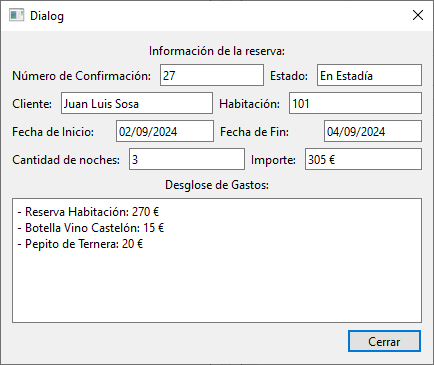

# Ventana Información de Reserva

Esta ventana y su clase correspondiente, manejan la lógica para mostrar los datos de una reserva específica del hotel. Utiliza como base una ventana QDialog de Qt.

## Elementos

### Atributos

|||
|---|---|
|Ui::InfoReserva*|[ui](#ui-uiinforeserva)|
|[Reserva](../../Clases/Reserva)*|[reserva](#reserva-reserva)|

***

### Métodos Públicos

|Retorno|Método|
|---|---|
||[InfoReserva](#inforeservaqwidget-parent--nullptr)(QWidget* parent = nullptr)|
||~[InfoReserva](#inforeserva)()|
|void|[setReserva](#reserva-reserva)([Reserva](../../Clases/Reserva)* reserva)|
|void|[mostrar](#void-mostrar)()|
|void|[limpiar](#void-limpiar)()|

### Slots Públicos

|Retorno|Slot|
|---|---|
|void|[cerrar](#void-cerrar)()|

## Descripción Detallada

### ui: Ui::InfoReserva*

Este atributo almacena una referencia a la interfaz del usuario para poder acceder a los elementos visuales incuidos en ella.

***

### reserva: [Reserva](../../Clases/Reserva)*

Este atributo almacena una referencia al objeto de tipo [Reserva](../../Clases/Reserva) cuyos datos serán mostrados.  
Este valor se inicializa como `nullptr` al crear una instancia.  
  
**Funciones de acceso:**
  
|Tipo|Retorno|Función|
|---|---|---|
|Escritura|void|setReserva([Reserva](../../Clases/Reserva)* reserva)|

***

### InfoReserva(QWidget* parent = nullptr)

Construye un objeto de tipo InfoReserva con los parámetros establecidos y lo conecta con su interfaz de usuario.  
Conecta la señal de click en el botón Cerrar con el SLOT [cerrar](#void-cerrar)().  

***

### ~InfoReserva()

Elimina el atributo [ui](#ui-uiinforeserva).  

***

### void mostrar()

Comprueba si se estableció una referencia a un objeto de tipo [Reserva](../../Clases/Reserva) en el atributo [reserva](#reserva-reserva), en cuyo caso, llena la información correspondiente en la interfaz de usuario con los datos de la reserva.

***

### void limpiar()

Borra los datos guardados en los elementos de la interfaz de usuario.  

***

### void cerrar()

Llama al método [limpiar](#void-limpiar)() y cierra la ventana.
