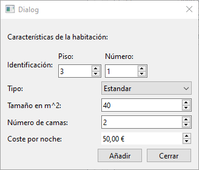

# Ventana Añadir Habitación

Esta ventana y su clase correspondiente, manejan la lógica para añadir una habitación a la base de datos del hotel con los datos introducidos en la interfaz. Utiliza como base una ventana QDialog de Qt.

## Elementos

### Atributos

|||
|---|---|
|Ui::AniadirHabitacion*|[ui](#ui-uianiadirhabitacion)|
|vector\<[Habitacion](../../Clases/Habitacion)>*|[habitaciones](#habitaciones-vectorhabitacion)|
|[ControladorBD](../../Clases/ControladorBD)*|[controladorBD](#controladorbd-controladorbd)|
|bool|[ventanaAbierta](#ventanaabierta-bool)|

***

### Métodos Públicos

|Retorno|Método|
|---|---|
||[AniadirHabitacion](#aniadirhabitacionvectorhabitacion-habitaciones-qwidget-parent--nullptr-controladorbd-controladorbd)(vector\<[Habitacion](../../Clases/Habitacion)>\* habitaciones, QWidget\* parent = nullptr, [ControladorBD](../../Clases/ControladorBD)* controladorBD)|
||~[AniadirHabitacion](#aniadirhabitacion)()|
|void|[abrirVentana](#void-abrirventana)()|
|void|[limpiarVentana](#void-limpiarventana)()|

### Slots Privados

|Retorno|Slot|
|---|---|
|void|[aniadirHabitacion](#aniadirhabitacion)()|
|void|[cerrar](#void-cerrar)()|

### Señales

|Retorno|Señal|
|---|---|
|void|[cerrarVentana](#cerrarventanabool-cerrar--false)(bool cerrar = false)|
|void|[aniadido](#aniadidobool-actualizar--false)(bool actualizar = false)|

## Descripción Detallada

### ui: Ui::AniadirHabitacion*

Este atributo almacena una referencia a la interfaz del usuario para poder acceder a los elementos visuales incuidos en ella.

***

### habitaciones: vector\<[Habitacion](../../Clases/Habitacion)>*

Este atributo almacena una referencia a las habitaciones almacenadas en la memoria de la aplicación.  
Este valor debe ser indicado al crear una instancia.  

***

### controladorBD: [ControladorBD](../../Clases/ControladorBD)*

Este atributo almacena una referencia al objeto de tipo [ControladorBD](../../Clases/ControladorBD) que maneja las consultas a la base de datos del hotel.  
Este valor se inicializa como `nullptr` al crear una instancia.  

***

### ventanaAbierta: bool

Este atributo indica si esta ventana se encuentra visible para el usuario.  
Este valor se inicializa como `false` al crear una instancia.  

***

### AniadirHabitacion(vector\<[Habitacion](../../Clases/Habitacion)>\* habitaciones, QWidget\* parent = nullptr, [ControladorBD](../../Clases/ControladorBD)* controladorBD)

Construye un objeto de tipo AniadirHabitacion con los parámetros establecidos y lo conecta con su interfaz de usuario.  
Conecta la señal de click en el botón Aniadir con el SLOT [aniadirHabitacion](#void-aniadirhabitacion)().  
Conecta la señal de click en el botón Cerrar con el SLOT [cerrar](#void-cerrar)().  
Conecta la señal de cerrar de la ventana con el SLOT [cerrar](#void-cerrar)().  

***

### ~AniadirHabitacion()

Elimina el atributo [ui](#ui-uianiadirhabitacion).  

***

### void abrirVentana()

Establece el valor del atributo [ventanaAbierta](#ventanaabierta-bool) en `true`.

***

### void limpiarVentana()

Borra los datos guardados en los elementos de la interfaz de usuario.  

***

### void aniadirHabitacion()

Lee los datos en la interfaz de usuario y llama con ellos al método [crearHabitacion](../../Clases/ControladorBD/README.md#habitacion-crearhabitacionint-numero-qstring-tipo-int-tamanio-int-camas-float-coste) de la clase [ControladorBD](../../Clases/ControladorBD).  
Toma el objeto de tipo [Habitacion](../../Clases/Habitacion) devuelto por el método y lo añade al vector de habitaciones referenciado por el atributo [habitaciones](#habitaciones-vectorhabitacion).
Emite la señal [aniadido](#aniadidobool-actualizar--false)(`true`).

***

### void cerrar()

Llama al método [limpiarVentana](#void-limpiarventana)(), establece el atributo [ventanaAbierta](#ventanaabierta-bool) en `false` y emite la señal [cerrarVentana](#cerrarventanabool-cerrar--false)(`true`).

***

### cerrarVentana(bool cerrar = false)

Se emite cuando se deba cerrar la ventana.

***

### aniadido(bool actualizar = false)

Se emite cuando se añade un objeto de tipo [Habitacion](../../Clases/Habitacion) al vector referenciado por el atributo [habitaciones](#habitaciones-vectorhabitacion).
