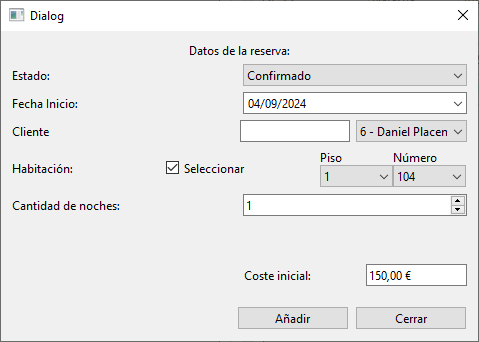

# Ventana Añadir Reserva

Esta ventana y su clase correspondiente, manejan la lógica para añadir o modificar una reserva en la base de datos del hotel con los datos introducidos en la interfaz. Utiliza como base una ventana QDialog de Qt.

## Elementos

### Atributos

|||
|---|---|
|Ui::AniadirReserva*|[ui](#ui-uianiadirreserva)|
|vector\<[Cliente](../../Clases/Cliente)>*|[clientes](#clientes-vectorcliente)|
|vector\<[Habitacion](../../Clases/Habitacion)>*|[habitaciones](#habitaciones-vectorhabitacion)|
|vector\<[Reserva](../../Clases/Reserva)>*|[reservas](#reservas-vectorreserva)|
|[ControladorBD](../../Clases/ControladorBD)*|[controladorBD](#controladorbd-controladorbd)|
|bool|[ventanaAbierta](#ventanaabierta-bool)|

***

### Métodos Públicos

|Retorno|Método|
|---|---|
||[AniadirReserva](#aniadirreservavectorcliente-clientes-vectorhabitacion-habitaciones-vectorreserva-reservas-qwidget-parent--nullptr-controladorbd-controladorbd--nullptr)(vector\<[Cliente](../../Clases/Cliente)>\* clientes, vector\<[Habitacion](../../Clases/Habitacion)>\* habitaciones, vector\<[Reserva](../../Clases/Reserva)>\* reservas, QWidget\* parent = nullptr, [ControladorBD](../../Clases/ControladorBD) *controladorBD = nullptr)|
||~[AniadirReserva](#aniadirreserva)()|
|void|[abrirVentana](#void-abrirventana)()|
|void|[abrirVentana](#void-abrirventanareserva-reserva)([Reserva](../../Clases/Reserva) *reserva)|
|void|[limpiarVentana](#void-limpiarventana)()|
|bool|[verificarDisponibilidadHabitacion](#bool-verificardisponibilidadhabitacionint-numerohabitacion-qdate-inicio-int-dias)(int numeroHabitacion, QDate inicio, int dias)|

### Métodos Privados

|Retorno|Método|
|---|---|
|void|[rellenarComboBoxClientes](#void-rellenarcomboboxclientes)()|
|void|[rellenarComboBoxClientes](#void-rellenarcomboboxclientessetint-clientesid)(set\<int\> *clientesID)|
|void|[rellenarPisosHabitaciones](#void-rellenarpisoshabitaciones)()|

### Slots Privados

|Retorno|Slot|
|---|---|
|void|[cerrar](#void-cerrar)()|
|void|[actualizarCoste](#void-actualizarcoste)()|
|void|[actualizarNumerosHabitaciones](#void-actualizarnumeroshabitaciones)()|
|void|[activarSeleccionFecha](#void-activarseleccionfecha)()|
|void|[modificarReserva](#void-modificarreserva)()|
|void|[aniadir](#void-aniadir)()|
|void|[habilitarHabitacion](#void-habilitarhabitacionint-arg1)(int arg1)|
|void|[actualizarClientes](#void-actualizarclientesconst-qstring-arg1)(const QString &arg1)|

### Señales

|Retorno|Señal|
|---|---|
|void|[cerrarVentana](#void-cerrarventanabool-cerrar--false)(bool cerrar = false)|
|void|[aniadido](#void-aniadidobool-actualizar--false)(bool actualizar = false)|

## Descripción Detallada

### ui: Ui::AniadirReserva*

Este atributo almacena una referencia a la interfaz del usuario para poder acceder a los elementos visuales incuidos en ella.

***

### clientes: vector\<[Cliente](../../Clases/Cliente)>*

Este atributo almacena una referencia a los clientes almacenados en la memoria de la aplicación.  
Este valor debe ser indicado al crear una instancia.  

***

### habitaciones: vector\<[Habitacion](../../Clases/Habitacion)>*

Este atributo almacena una referencia a las habitaciones almacenadas en la memoria de la aplicación.  
Este valor debe ser indicado al crear una instancia.  

***

### reservas: vector\<[Reserva](../../Clases/Reserva)>*

Este atributo almacena una referencia a las reservas almacenadas en la memoria de la aplicación.  
Este valor debe ser indicado al crear una instancia.  

***

### reserva: [Reserva](../../Clases/Reserva)*

Este atributo almacena una referencia al objeto de tipo [Reserva](../../Clases/Reserva) que indica la reserva que se quiere modificar.  
Este valor se inicializa como `nullptr` al crear una instancia.  

***

### controladorBD: [ControladorBD](../../Clases/ControladorBD)*

Este atributo almacena una referencia al objeto de tipo [ControladorBD](../../Clases/ControladorBD) que maneja las consultas a la base de datos del hotel.  
Este valor se inicializa como `nullptr` al crear una instancia.  

***

### ventanaAbierta: bool

Este atributo indica si esta ventana se encuentra visible para el usuario.  
Este valor se inicializa como `false` al crear una instancia.  

***

### AniadirReserva(vector\<[Cliente](../../Clases/Cliente)>\* clientes, vector\<[Habitacion](../../Clases/Habitacion)>\* habitaciones, vector\<[Reserva](../../Clases/Reserva)>\* reservas, QWidget\* parent = nullptr, [ControladorBD](../../Clases/ControladorBD) *controladorBD = nullptr)

Construye un objeto de tipo AniadirHabitacion con los parámetros establecidos y lo conecta con su interfaz de usuario.  
Conecta las señales con sus slots correspondientes.  

***

### ~AniadirReserva()

Elimina el atributo [ui](#ui-uianiadirreserva).  

***

### void abrirVentana()

Abre la ventana con la opción de añadir una nueva reserva, establece los valores iniciales en la interfaz de usuario y el valor del atributo [ventanaAbierta](#ventanaabierta-bool) en `true`.

***

### void abrirVentana([Reserva](../../Clases/Reserva)* reserva)

Sobrecarga del método [abrirVentana](#void-abrirventana)().  
Establece los datos de la reserva pasada como argumento en la interfaz de usuario.
No permite cambiar el nombre del cliente asociado a la reserva.

***

### void limpiarVentana()

Devuelve los datos guardados en los elementos de la interfaz de usuario a sus valores por defecto y elimina la referencia en el atributo [reserva](#reserva-reserva).  

***

### bool verificarDisponibilidadHabitacion(int numeroHabitacion, QDate inicio, int dias)

Determina si una habitación está disponible durante todos los días indicados a partir de la fecha indicada.

***

### void rellenarComboBoxClientes()

Rellena el QComboBox de la interfaz de usuario con los datos de todos los clientes.

***

### void rellenarComboBoxClientes(set\<int>* clientesID)

Sobrecarga del método [rellenarComboBoxClientes](#void-rellenarcomboboxclientes)().  
Muestra solamente los clientes cuyo identificador se encuentre en el conjunto `clientesID`.

***

### void rellenarPisosHabitaciones()

Rellena el QComboBox de la interfaz de usuario con los diferentes pisos del hotel.

***

### void cerrar()

Llama al método [limpiarVentana](#void-limpiarventana)(), establece el atributo [ventanaAbierta](#ventanaabierta-bool) en `false` y emite la señal [cerrarVentana](#void-cerrarventanabool-cerrar--false)(`true`).

***

### void actualizarCoste()

Actualiza el coste de la reserva mostrado en la interfaz de usuario según la habitación y cantidad de días seleccionados.

***

### void actualizarNumerosHabitaciones()

Rellena el QComboBox de la interfaz de usuario con las habitaciones del hotel.  
Muestra solamente las habitaciones disponibles en el piso seleccionado.

***

### void activarSeleccionFecha()

Activa o desactiva la posibilidad de elegir una fecha para reservar.

***

### void modificarReserva()

Si la ventana fue abierta para modificar una reserva, actualiza su valor tanto en la Base de Datos como en el objeto referenciado por [reserva](#reserva-reserva) según los datos introducidos en la interfaz de usuario.  
Emite la señal [aniadido](#void-aniadidobool-actualizar--false)(true).

***

### void aniadir()

Si la ventana fue abierta para añadir una reserva, añade su valor tanto en la Base de Datos como en el vector de tipo [Reserva](../../Clases/Reserva) referenciado por [reservas](#reservas-vectorreserva) según los datos introducidos en la interfaz de usuario.  
Emite la señal [aniadido](#void-aniadidobool-actualizar--false)(true).

***

### void habilitarHabitacion(int arg1)

Activa o desactiva la posibilidad de elegir una habitación para reservar.

***

### void actualizarClientes(const QString &arg1)

Rellena el QComboBox de la interfaz de usuario con los clientes del hotel.  
Muestra solamente los clientes cuyo nombre o identificador coincidan con el valor escrito.

***

### void cerrarVentana(bool cerrar = false)

Se emite cuando se deba cerrar la ventana.

***

### void aniadido(bool actualizar = false)

Se emite cuando se añade un objeto de tipo [Reserva](../../Clases/Reserva) al vector referenciado por el atributo [reservas](#reservas-vectorreserva), o cuando se modifica el objeto referenciado por el atributo [reserva](#reserva-reserva).
