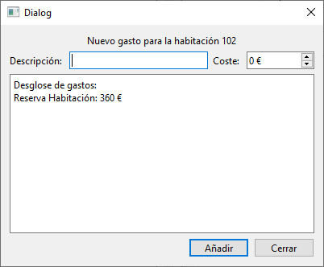

# Ventana Añadir Gasto

Esta ventana y su clase correspondiente, manejan la lógica para añadir gastos a una reserva en estadía en el hotel. Utiliza como base una ventana QDialog de Qt.

## Elementos

### Atributos

|||
|---|---|
|Ui::AniadirGasto*|[ui](#ui-uianiadirgasto)|
|[Reserva](../../Clases/Reserva)*|[reserva](#reserva-reserva)|
|[ControladorBD](../../Clases/ControladorBD)*|[controladorBD](#controladorbd-controladorbd)|

***

### Métodos Públicos

|Retorno|Método|
|---|---|
||[AniadirGasto](#aniadirgastocontroladorbd-controladorbd-qwidget-parent--nullptr)([ControladorBD](../../Clases/ControladorBD)* controladorBD, QWidget\* parent = nullptr)|
||~[AniadirGasto](#aniadirgasto)()|
|void|[setReserva](#reserva-reserva)([Reserva](../../Clases/Reserva)* reserva)|
|void|[mostrar](#void-mostrar)()|
|void|[limpiar](#void-limpiar)()|

### Slots Públicos

|Retorno|Slot|
|---|---|
|void|[cerrar](#void-cerrar)()|
|void|[aniadir](#void-aniadir)()|

### Señales

|Retorno|Señal|
|---|---|
|void|[actualizar](#void-actualizarbool-actualizar--false)(bool actualizar = false)|

## Descripción Detallada

### ui: Ui::AniadirGasto*

Este atributo almacena una referencia a la interfaz del usuario para poder acceder a los elementos visuales incuidos en ella.

***

### reserva: [Reserva](../../Clases/Reserva)*

Este atributo almacena una referencia al objeto de tipo [Reserva](../../Clases/Reserva) cuyo atributo [desgloseGastos](../../Clases/Reserva/README.md#desglosegastos-vectorpairqstringfloat) será modificado.  
Este valor se inicializa como `nullptr` al crear una instancia.  
  
**Funciones de acceso:**
  
|Tipo|Retorno|Función|
|---|---|---|
|Escritura|void|setReserva([Reserva](../../Clases/Reserva)* reserva)|

***

### controladorBD: [ControladorBD](../../Clases/ControladorBD)*

Este atributo almacena una referencia al objeto de tipo [ControladorBD](../../Clases/ControladorBD) que maneja las consultas a la base de datos del hotel.  
Este valor debe ser indicado al crear una instancia.

***

### AniadirGasto([ControladorBD](../../Clases/ControladorBD)* controladorBD, QWidget\* parent = nullptr)

Construye un objeto de tipo AniadirGasto con los parámetros establecidos y lo conecta con su interfaz de usuario.  
Conecta la señal de click en el botón Cerrar con el SLOT [cerrar](#void-cerrar)().  
Conecta la señal de click en el botón Aniadir con el SLOT [aniadir](#void-aniadir)().

***

### ~AniadirGasto()

Elimina el atributo [ui](#ui-uianiadirgasto).  

***

### void mostrar()

Comprueba si se estableció una referencia a un objeto de tipo [Reserva](../../Clases/Reserva) en el atributo [reserva](#reserva-reserva), en cuyo caso, llena la información correspondiente en la interfaz de usuario con los datos de la reserva.

***

### void limpiar()

Borra los datos guardados en los elementos de la interfaz de usuario.  

***

### void cerrar()

Llama al método [limpiar](#void-limpiar)() y cierra la ventana.

***

### void aniadir()

Comprueba si se estableció una referencia a un objeto de tipo [Reserva](../../Clases/Reserva) en el atributo [reserva](#reserva-reserva).  
En caso positivo, añade un gasto en la Base de Datos y el objeto referenciado por el atributo [reserva](#reserva-reserva) con la descripción y el coste en la interfaz de usuario y emite la señal [actualizar](#void-actualizarbool-actualizar--false)(true).

***

### void actualizar(bool actualizar = false)

Se emite cuando se cambia la información en el objeto de tipo [Reserva](../../Clases/Reserva) referenciado por el atributo [reserva](#reserva-reserva).
