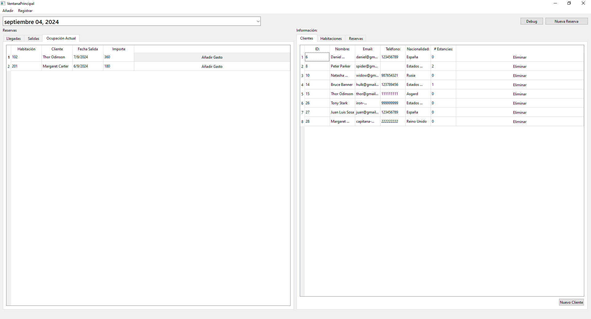

# Ventana Principal

Esta ventana y su clase correspondiente, constituyen el núcleo del programa y manejan toda su lógica. Se encarga de llamar a las demás ventanas e inicializar todas las variables para almacenar datos.

## Elementos

### Atributos

|||
|---|---|
|Ui::VentanaPrincipal*|[ui](#ui-uiventanaprincipal)|
|[Cliente](../../Clases/Cliente)|[clientes](#clientes-vectorcliente)|
|[Habitacion](../../Clases/Habitacion)|[habitaciones](#habitaciones-vectorhabitacion)|
|[Reserva](../../Clases/Reserva)|[reservas](#reservas-vectorreserva)|
|[ControladorBD](../../Clases/ControladorBD)*|[controladorBD](#controladorbd-controladorbd)|
|QDate|[fechaActual](#fechaactual-qdate)|
|[AniadirCliente](../Ventana_Nuevo_Cliente)*|[ventanaNuevoCliente](#ventananuevocliente-aniadircliente)|
|[AniadirHabitacion](../Ventana_Nueva_Habitacion)*|[ventanaNuevaHabitacion](#ventananuevahabitacion-aniadirhabitacion)|
|[AniadirReserva](../Ventana_Nueva_Reserva)*|[ventanaNuevaReserva](#ventananuevareserva-aniadirreserva)|
|[RegistrarEntrada](../Ventana_Registrar_Entrada)*|[ventanaRegistrarEntrada](#ventanaregistrarentrada-registrarentrada)|
|[RegistrarSalida](../Ventana_Registrar_Salida)*|[ventanaRegistrarSalida](#ventanaregistrarsalida-registrarsalida)|
|[InfoReserva](../Ventana_Info_Reserva)*|[ventanaInfoReserva](#ventanainforeserva-inforeserva)|
|[EstadoHabitacion](../Ventana_Estado_Habitacion)*|[ventanaEstadoHabitacion](#ventanaestadohabitacion-estadohabitacion)|
|[AniadirGasto](../Ventana_Nuevo_Gasto)*|[ventanaNuevoGasto](#ventananuevogasto-aniadirgasto)|

***

### Métodos Públicos

|Retorno|Método|
|---|---|
||[VentanaPrincipal](#ventanaprincipalqwidget-parent--nullptr)(QWidget* parent = nullptr)|
||~[VentanaPrincipal](#ventana-principal)()|
|void|[iniciarVentana](#void-iniciarventana)()|
|void|[llenarTablaReserva](#void-llenartablareservaqdate-fechacomparacion-qdate-fechaactual-reserva-reserva-qtablewidget-tablewidget-int-fila)(QDate fechaComparacion, QDate fechaActual, [Reserva](../../Clases/Reserva) reserva, QTableWidget* tableWidget, int* fila)|
|void|[llenarTablaOcupacion](#void-llenartablaocupacionreserva-reserva-qdate-fechaactual-int-fila)([Reserva](../../Clases/Reserva) reserva, QDate fechaActual, int* fila)|
|void|[llenarInfoDatos](#void-llenarinfodatos)()|
|void|[limpiarTabla](#void-limpiartablaqtablewidget-tabla)(QTableWidget* tabla)|
|void|[aniadirLineaInfoCliente](#void-aniadirlineainfoclientecliente-cliente)([Cliente](../../Clases/Cliente) cliente)|
|void|[aniadirLineaInfoHabitacion](#void-aniadirlineainfohabitacionhabitacion-habitacion)([Habitacion](../../Clases/Habitacion) habitacion)|
|void|[aniadirLineaInfoReserva](#void-aniadirlineainforeservareserva-reserva)([Reserva](../../Clases/Reserva) reserva)|

***

### Métodos Privados

|Retorno|Método|
|---|---|
|void|[conexiones](#void-conexiones)()|

***

### Slots Públicos

|Retorno|Slot|
|---|---|
|void|[llenarInfoReservas](#void-llenarinforeservas)()|

***

### Slots Privados

|Retorno|Slot|
|---|---|
|void|[nuevoCliente](#void-nuevocliente)()|
|void|[nuevaHabitacion](#void-nuevahabitacion)()|
|void|[crearNuevaReserva](#void-crearnuevareserva)()|
|void|[cerrarNuevoCliente](#void-cerrarnuevoclientebool-cerrar--false)(bool cerrar = false)|
|void|[cerrarNuevaHabitacion](#void-cerrarnuevahabitacionbool-cerrar--false)(bool cerrar = false)|
|void|[cerrarNuevaReserva](#void-cerrarnuevareservabool-cerrar--false)(bool cerrar = false)|
|void|[cerrarRegistrarEntrada](#void-cerrarregistrarentradabool-cerrar--false)(bool cerrar = false)|
|void|[cerrarRegistrarSalida](#void-cerrarregistrarsalidabool-cerrar--false)(bool cerrar = false)|
|void|[registrarNuevaEntrada](#void-registrarnuevaentradaint-fila---1-int-columna---1)(int fila = -1, int columna = -1)|
|void|[registrarNuevaSalida](#void-registrarnuevasalidaint-fila---1-int-columna---1)(int fila = -1, int columna = -1)|
|void|[eliminarCliente](#void-eliminarclienteint-clienteid---1)(int clienteID = -1)|
|void|[modificarEstadoHabitacion](#void-modificarestadohabitacionint-numerohabitacion---1)(int numeroHabitacion = -1)|
|void|[mostrarInfoReserva](#void-mostrarinforeservaint-numeroreserva---1)(int numeroReserva = -1)|
|void|[modificarReserva](#void-modificarreservaint-numeroreserva---1)(int numeroReserva = -1)|
|void|[aniadirGasto](#void-aniadirgastoint-numeroreserva---1)(int numeroReserva = -1)|
|void|[actualizarVectores](#void-actualizarvectoresbool-actualizar--false)(bool actualizar = false)|

## Descripción Detallada

### ui: Ui::VentanaPrincipal*

Este atributo almacena una referencia a la interfaz del usuario para poder acceder a los elementos visuales incuidos en ella.

***

### clientes: vector\<[Cliente](../../Clases/Cliente)>

Este atributo almacena los clientes del hotel.  

***

### habitaciones: vector\<[Habitacion](../../Clases/Habitacion)>

Este atributo almacena las habitaciones del hotel.  

***

### reservas: vector\<[Reserva](../../Clases/Reserva)>

Este atributo almacena las reservas del hotel.  

***

### controladorBD: [ControladorBD](../../Clases/ControladorBD)*

Este atributo almacena una referencia al objeto de tipo [ControladorBD](../../Clases/ControladorBD) que maneja las consultas a la base de datos del hotel.  

***

### fechaActual: QDate

Este atributo indica la fecha en que se basará la información que se muestra en la interfaz de usuario.  
Este valor se inicializa con la fecha actual al crear una instancia.  

***

### ventanaNuevoCliente: [AniadirCliente](../Ventana_Nuevo_Cliente)*

Este atributo referencia a una instancia de una ventana de tipo [AniadirCliente](../Ventana_Nuevo_Cliente) la cual se utilizará al manejar la lógica de añadir un cliente al registro del hotel.  

***

### ventanaNuevaHabitacion: [AniadirHabitacion](../Ventana_Nueva_Habitacion)*

Este atributo referencia a una instancia de una ventana de tipo [AniadirHabitacion](../Ventana_Nueva_Habitacion) la cual se utilizará al manejar la lógica de añadir una habitación al hotel.  

***

### ventanaNuevaReserva: [AniadirReserva](../Ventana_Nueva_Reserva)*

Este atributo referencia a una instancia de una ventana de tipo [AniadirReserva](../Ventana_Nueva_Reserva) la cual se utilizará al manejar la lógica de añadir y modificar una reserva en el registro del hotel.  

***

### ventanaRegistrarEntrada: [RegistrarEntrada](../Ventana_Registrar_Entrada)*

Este atributo referencia a una instancia de una ventana de tipo [RegistrarEntrada](../Ventana_Registrar_Entrada) la cual se utilizará al manejar la lógica de registrar la entrada de un cliente al hotel.  

***

### ventanaRegistrarSalida: [RegistrarSalida](../Ventana_Registrar_Salida)*

Este atributo referencia a una instancia de una ventana de tipo [RegistrarSalida](../Ventana_Registrar_Salida) la cual se utilizará al manejar la lógica de registrar la salida de un cliente del hotel.  

***

### ventanaInfoReserva: [InfoReserva](../Ventana_Info_Reserva)*

Este atributo referencia a una instancia de una ventana de tipo [InfoReserva](../Ventana_Info_Reserva) la cual se utilizará al manejar la lógica de mostrar y modificar información de una de las reservas en el registro del hotel.  

***

### ventanaEstadoHabitacion: [EstadoHabitacion](../Ventana_Estado_Habitacion)*

Este atributo referencia a una instancia de una ventana de tipo [EstadoHabitacion](../Ventana_Estado_Habitacion) la cual se utilizará al manejar la lógica de mostrar información de una de las habitaciones del hotel.  

***

### ventanaNuevoGasto: [AniadirGasto](../Ventana_Nuevo_Gasto)*

Este atributo referencia a una instancia de una ventana de tipo [AniadirGasto](../Ventana_Nuevo_Gasto) la cual se utilizará al manejar la lógica de añadir un gasto a una reserva activa en el hotel.  

***

### VentanaPrincipal(QWidget* parent = nullptr)

Construye un objeto de tipo VentanaPrincipal y lo conecta con su interfaz de usuario.  
Llama a los métodos [iniciarVentana](#void-iniciarventana)() y [conexiones](#void-conexiones)().  

***

### ~VentanaPrincipal()

Elimina el atributo [ui](#ui-uiventanaprincipal).  

***

### void iniciarVentana()

Establece la fecha actual.  
Realiza la conexión con la Base de Datos y con las diversas ventanas.  
Rellena los vectores de datos [clientes](#clientes-vectorcliente), [habitaciones](#habitaciones-vectorhabitacion) y [reservas](#reservas-vectorreserva) con los datos de la Base de Datos.  
Llama al método [actualizarVectores](#void-actualizarvectoresbool-actualizar--false)(true)

***

### void llenarTablaReserva(QDate fechaComparacion, QDate fechaActual, [Reserva](../../Clases/Reserva) reserva, QTableWidget* tableWidget, int* fila)

Se encarga de insertar una fila a un objeto de tipo QTableWidget con datos de una reserva si los parámetros fechaComparacion y fechaActual coinciden.  
Sus parámetros le permiten encargarse de las tablas de entrada o salida en diferentes fechas.

***

### void llenarTablaOcupacion([Reserva](../../Clases/Reserva) reserva, QDate fechaActual, int* fila)

Se encarga de insertar una fila a un objeto de tipo QTableWidget con datos de una reserva si esta en estadía.  
Añade un botón que conecta su señal de click con el slot [aniadirGasto](#void-aniadirgastoint-numeroreserva---1)(int) pasándole el número de su fila.

***

### void llenarInfoDatos()

Se encarga de llenar las tablas que muestran los datos de todos los clientes, habitaciones y reservas del hotel.  
Llama a los métodos [aniadirLineaInfoCliente](#void-aniadirlineainfoclientecliente-cliente)([Cliente](../../Clases/Cliente)), [aniadirLineaInfoHabitacion](#void-aniadirlineainfohabitacionhabitacion-habitacion)([Habitacion](../../Clases/Habitacion)) y [aniadirLineaInfoReserva](#void-aniadirlineainforeservareserva-reserva)([Reserva](../../Clases/Reserva)) según corresponda.

***
***
***
***
***
***
***
***
***
***
***
***
***

### void limpiarTabla(QTableWidget* tabla)

Rellena el QComboBox de la interfaz de usuario con los datos de todos los clientes.

***

### void aniadirLineaInfoCliente([Cliente](../../Clases/Cliente) cliente)

Rellena el QComboBox de la interfaz de usuario con los datos de todos los clientes.

***

### void aniadirLineaInfoHabitacion([Habitacion](../../Clases/Habitacion) habitacion)

Rellena el QComboBox de la interfaz de usuario con los datos de todos los clientes.

***

### void aniadirLineaInfoReserva([Reserva](../../Clases/Reserva) reserva)

Rellena el QComboBox de la interfaz de usuario con los datos de todos los clientes.

***

### void conexiones()

Rellena el QComboBox de la interfaz de usuario con los datos de todos los clientes.

***

### void llenarInfoReservas()

Se encarga de llenar las tablas que muestran la ocupación actual del hotel y las reservas entrantes y salientes.  
Para cada reserva almacenada llama al método [llenarTablaReserva](#void-llenartablareservaqdate-fechacomparacion-qdate-fechaactual-reserva-reserva-qtablewidget-tablewidget-int-fila)(QDate fechaComparacion, QDate fechaActual, [Reserva](../../Clases/Reserva) reserva, QTableWidget* tableWidget, int* fila) con parámetros correspondientes a la tabla a llenar, y al método [llenarTablaOcupacion](#void-llenartablaocupacionreserva-reserva-qdate-fechaactual-int-fila)([Reserva](../../Clases/Reserva) reserva, QDate fechaActual, int* fila).

***

### void nuevoCliente()

Rellena el QComboBox de la interfaz de usuario con los datos de todos los clientes.

***

### void nuevaHabitacion()

Rellena el QComboBox de la interfaz de usuario con los datos de todos los clientes.

***

### void crearNuevaReserva()

Rellena el QComboBox de la interfaz de usuario con los datos de todos los clientes.

***

### void cerrarNuevoCliente(bool cerrar = false)

Rellena el QComboBox de la interfaz de usuario con los datos de todos los clientes.

***

### void cerrarNuevaHabitacion(bool cerrar = false)

Rellena el QComboBox de la interfaz de usuario con los datos de todos los clientes.

***

### void cerrarNuevaReserva(bool cerrar = false)

Rellena el QComboBox de la interfaz de usuario con los datos de todos los clientes.

***

### void cerrarRegistrarEntrada(bool cerrar = false)

Rellena el QComboBox de la interfaz de usuario con los datos de todos los clientes.

***

### void cerrarRegistrarSalida(bool cerrar = false)

Rellena el QComboBox de la interfaz de usuario con los datos de todos los clientes.

***

### void registrarNuevaEntrada(int fila = -1, int columna = -1)

Rellena el QComboBox de la interfaz de usuario con los datos de todos los clientes.

***

### void registrarNuevaSalida(int fila = -1, int columna = -1)

Rellena el QComboBox de la interfaz de usuario con los datos de todos los clientes.

***

### void eliminarCliente(int clienteID = -1)

Rellena el QComboBox de la interfaz de usuario con los datos de todos los clientes.

***

### void modificarEstadoHabitacion(int numeroHabitacion = -1)

Rellena el QComboBox de la interfaz de usuario con los datos de todos los clientes.

***

### void mostrarInfoReserva(int numeroReserva = -1)

Rellena el QComboBox de la interfaz de usuario con los datos de todos los clientes.

***

### void modificarReserva(int numeroReserva = -1)

Rellena el QComboBox de la interfaz de usuario con los datos de todos los clientes.

***

### void aniadirGasto(int numeroReserva = -1)

Rellena el QComboBox de la interfaz de usuario con los datos de todos los clientes.

***

### void actualizarVectores(bool actualizar = false)

Rellena el QComboBox de la interfaz de usuario con los datos de todos los clientes.