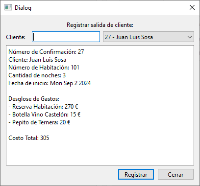

# Ventana Registrar Salida

Esta ventana y su clase correspondiente, manejan la lógica para registrar la salida de un cliente luego de su estadía. Utiliza como base una ventana QDialog de Qt.

## Elementos

### Atributos

|||
|---|---|
|Ui::RegistrarSalida*|[ui](#ui-uiregistrarsalida)|
|vector\<[Reserva](../../Clases/Reserva)>*|[reservas](#reservas-vectorreserva)|
|[ControladorBD](../../Clases/ControladorBD)*|[controladorBD](#controladorbd-controladorbd)|
|bool|[ventanaAbierta](#ventanaabierta-bool)|

***

### Métodos Públicos

|Retorno|Método|
|---|---|
||[RegistrarSalida](#registrarsalidavectorreserva-reservas-controladorbd-controladorbd--nullptr-qwidget-parent--nullptr)(vector\<[Reserva](../../Clases/Reserva)>\* reservas, [ControladorBD](../../Clases/ControladorBD) *controladorBD = nullptr, QWidget\* parent = nullptr)|
||~[RegistrarSalida](#registrarsalida)()|
|void|[abrirVentana](#void-abrirventana)()|
|void|[limpiarVentana](#void-limpiarventana)()|
|bool|[establecerCliente](#void-establecerclienteqstring-cliente)(QString cliente)|

### Slots Privados

|Retorno|Slot|
|---|---|
|void|[cerrar](#void-cerrar)()|
|void|[rellenarComboBoxClientes](#void-rellenarcomboboxclientes)()|
|void|[rellenarComboBoxClientes](#void-rellenarcomboboxclientessetint-clientesid)(set\<int\> *clientesID)|
|void|[buscarClientes](#void-buscarclientesqstring-cliente--)(QString cliente = "")|
|void|[rellenarInformacionReserva](#void-rellenarinformacionreserva)()|
|void|[registrar](#void-registrar)()|

### Señales

|Retorno|Señal|
|---|---|
|void|[cerrarVentana](#void-cerrarventanabool-cerrar--false)(bool cerrar = false)|
|void|[registrado](#void-registradobool-actualizar--false)(bool actualizar = false)|

## Descripción Detallada

### ui: Ui::RegistrarSalida*

Este atributo almacena una referencia a la interfaz del usuario para poder acceder a los elementos visuales incuidos en ella.

***

### reservas: vector\<[Reserva](../../Clases/Reserva)>*

Este atributo almacena una referencia a las reservas almacenadas en la memoria de la aplicación.  
Este valor debe ser indicado al crear una instancia.  

***

### controladorBD: [ControladorBD](../../Clases/ControladorBD)*

Este atributo almacena una referencia al objeto de tipo [ControladorBD](../../Clases/ControladorBD) que maneja las consultas a la base de datos del hotel.  
Este valor debe ser indicado al crear una instancia.  

***

### ventanaAbierta: bool

Este atributo indica si esta ventana se encuentra visible para el usuario.  
Este valor se inicializa como `false` al crear una instancia.  

***

### RegistrarSalida(vector\<[Reserva](../../Clases/Reserva)>\* reservas, [ControladorBD](../../Clases/ControladorBD) *controladorBD = nullptr, QWidget\* parent = nullptr)

Construye un objeto de tipo RegistrarSalida con los parámetros establecidos y lo conecta con su interfaz de usuario.  
Conecta las señales con sus slots correspondientes.  

***

### ~RegistrarSalida()

Elimina el atributo [ui](#ui-uiregistrarsalida).  

***

### void abrirVentana()

Establece el valor del atributo [ventanaAbierta](#ventanaabierta-bool) en `true`.

***

### void limpiarVentana()

Borra los datos guardados en los elementos de la interfaz de usuario.  

***

### void establecerCliente(QString cliente)

Establece el nombre del cliente para registrar su salida.

***

### void cerrar()

Llama al método [limpiarVentana](#void-limpiarventana)(), establece el atributo [ventanaAbierta](#ventanaabierta-bool) en `false` y emite la señal [cerrarVentana](#void-cerrarventanabool-cerrar--false)(`true`).

***

### void rellenarComboBoxClientes()

Rellena el QComboBox de la interfaz de usuario con los datos de todos los clientes en estadía que deban salir en el día actual.

***

### void rellenarComboBoxClientes(set\<int>* clientesID)

Sobrecarga del método [rellenarComboBoxClientes](#void-rellenarcomboboxclientes)().  
Muestra solamente los clientes cuyo identificador se encuentre en el conjunto `clientesID`.

***

### void buscarClientes(QString cliente = "")

Rellena el QComboBox de la interfaz de usuario con los clientes del hotel.  
Muestra solamente los clientes cuyo nombre o identificador coincidan con el valor escrito.

***

### void rellenarInformacionReserva()

Muestra la información correspondiente de la reserva a registrar.

***

### void registrar()

Actualiza los datos de la reserva tanto en la Base de Datos como en el objeto correspondiente en el vector referenciado por [reservas](#reservas-vectorreserva).  
Emite la señal [registrado](#void-registradobool-actualizar--false)(true).

***

### void cerrarVentana(bool cerrar = false)

Se emite cuando se deba cerrar la ventana.

***

### void registrado(bool actualizar = false)

Se emite cuando se modifica el estado en un objeto de tipo [Reserva](../../Clases/Reserva) en el vector referenciado por el atributo [reservas](#reservas-vectorreserva).
